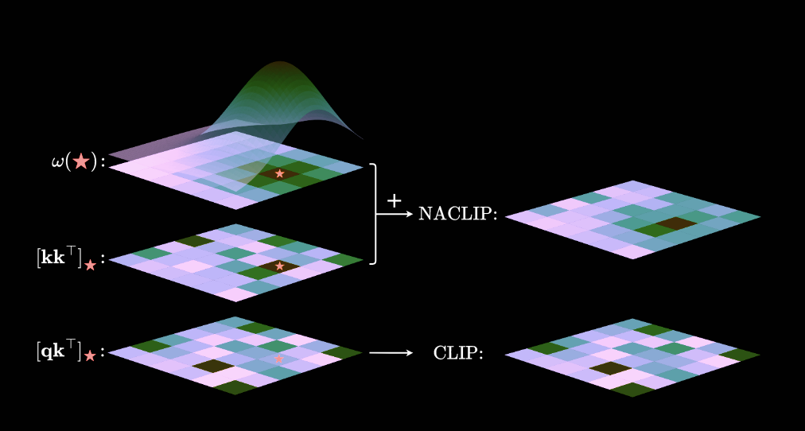
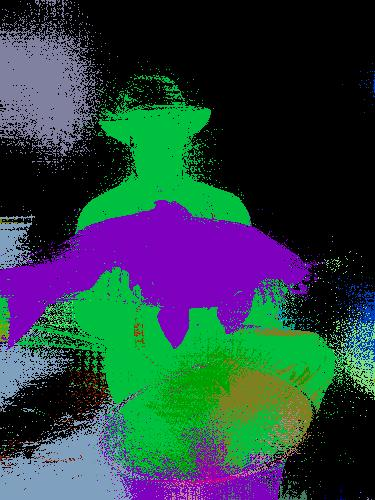
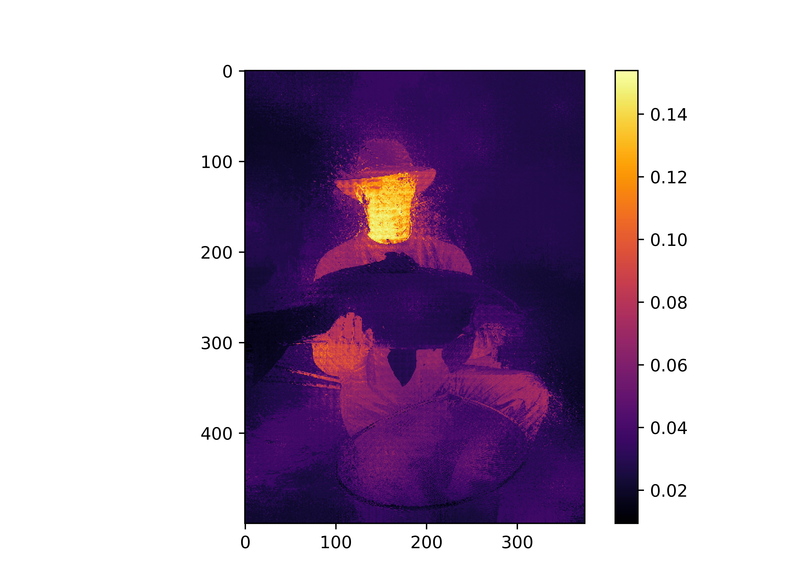

# Jittor Based NACLIP

我们使用jittor实现了一个图像分割的网络，名为NACLIP[1]，其使用了基于torch版本的clip backbone[2]和基于jittor的下游任务实现。

## NACLIP介绍
传统的语义分割方法受限于固定的类别集合，无法应对训练期间未见的类别。开词汇语义分割（OVSS）试图解决这一问题，当前一些方法基于CLIP等视觉-语言模型来扩展词汇能力。大部分OVSS方法需要监督或弱监督的训练过程，以提升模型在像素级上的预测能力。NACLIP为一类training free的模型，利用了CLIP的语义空间和图像空间对其的训练特性，通过比较ViT中CLS之外的patch的最后一维的表征与语义embedding的相似度，从而获得了training free的像素粒度的图像分割模型。

### 算法原理
NACLIP的核心思想是优化CLIP在分割任务中的性能，主要针对ViT的局限性进行了两项关键的改进：邻域关注机制和自注意力模块的改进。

1. **邻域关注机制（Neighbourhood Attention）**  
   在语义分割中，空间一致性对于定位至关重要，但在CLIP中没有得到足够重视。NACLIP通过在CLIP的自注意力模块中引入一个二维高斯核函数，增加了每个图像块对其邻域的关注度。这样一来，每个图像块不仅关注自身，还会关注附近的图像块，从而提高了分割任务的空间一致性。

2. **相似性度量的改进（Key-Key Similarity）**  
   传统的自注意力模块使用查询（query）和键（key）之间的点积作为相似性度量，但这对于分割任务而言并不理想。NACLIP改为使用键-键（key-key）的点积，这样具有相似特征的图像块可以更容易地相互关注，提高了模型在分割任务中的准确性。

3. **消除图像级别的专用单元（Elimination of Image-Level Specialized Units）**  
   NACLIP进一步简化了CLIP视觉编码器的结构，去除了一些对图像级任务有用但对密集预测任务（如语义分割）不利的模块，特别是移除了最后一层编码器中的前馈网络模块，使得视觉编码器更适合于语义分割任务。

通过这些改进，NACLIP能够在无需额外数据、无需超参数调试的情况下，显著提高CLIP在开词汇语义分割任务中的表现。

### 邻域关注机制的数学公式

在NACLIP中，邻域关注机制通过引入一个二维高斯核函数来增强每个图像块对其邻域的关注。具体的数学公式如下：

#### 高斯核函数
首先，定义一个二维高斯核函数：

\[
\varphi(x;\mu,\Sigma) = \exp \left( -\frac{1}{2}(x - \mu)^T \Sigma^{-1}(x - \mu) \right)
\]

假设 \(\Sigma = \sigma^2 I\)，可以简化为：

\[
\varphi(x;\mu,\sigma) = \exp \left( -\frac{\|x - \mu\|^2}{2\sigma^2} \right)
\]

该高斯核在 \(x = \mu\) 处达到最大值，并随着 \(x\) 到 \(\mu\) 的欧几里得距离增加而减小。

#### 离散化和邻域注意力计算
定义一个函数 \(\omega(i,j)\)，它接受一个坐标输入，并输出一个大小为 \(h \times w\) 的矩阵：

\[
\omega((i,j);\sigma)_{mn} = \varphi((m,n); (i,j), \sigma)
\]

对于所有 \(m \in \{1,2,\dots,h\}\) 和 \(n \in \{1,2,\dots,w\}\)，其中 \(\mu = (i,j)\) 是当前图像块的位置，\(\varphi\) 表示每个图像块与其邻域之间的关系。

#### 归一化的邻域注意力
在此基础上，假设注意力图的对数值已经设置为零，并且定义新的注意力值为：

\[
A_{ij} = \text{softmax}(\omega((i,j), \sigma)) v
\]

其中，\(v\) 是相应图像块的值向量。这样，注意力将只关注邻域的图像块。

#### 完整的邻域注意力公式

为了进一步增强空间一致性，可以将上述高斯核与标准的相似性度量（点积相似性）相加，如公式所示，同时如图所示：

\[
A_{ij} = \text{softmax} \left( \text{sim}_{ij} + \omega((i,j);\sigma) \right) v
\]

其中 \(\text{sim}_{ij}\) 是标准的点积相似度（即查询向量和键向量的点积）。最终的输出为：

\[
S_{ij} = A_{ij} W_o
\]

通过将高斯核引入注意力机制，这个公式确保了图像块之间的空间一致性，使得相邻的图像块得到更强的关注，有助于提高语义分割任务的表现。

### NACLIP对相似性度量的改进

在NACLIP中，**相似性度量的改进**是通过调整自注意力模块中的相似性度量方法来优化图像块之间的交互。传统的CLIP模型在自注意力机制中使用**query** 和 **key**之间的点积来计算相似性，但这对密集预测任务（如语义分割）并不总是最优的。NACLIP通过以下方式改进了相似性度量：

#### 1. 传统的相似性度量（Query-Key Similarity）
在标准的自注意力机制中，相似性度量是通过查询向量（query）和键向量（key）之间的点积来计算的：

\[
\text{sim}_{ij} = \frac{\mathbf{q}_i \cdot \mathbf{k}_j}{\sqrt{d}}
\]

其中，\(\mathbf{q}_i\) 是位置 \(i\) 的查询向量，\(\mathbf{k}_j\) 是位置 \(j\) 的键向量，\(d\) 是向量的维度。这个度量反映了每个图像块（patch）与其他图像块的关系，但对于密集预测任务，这种度量没有充分考虑到图像块的空间上下文和局部相似性。

#### 2. NACLIP中的改进：使用**Key-Key相似性**
NACLIP提出了一种新的相似性度量方法，即**键-键相似性（Key-Key Similarity）**，通过修改查询-键的相似性计算方式来改进密集预测任务的效果。NACLIP建议，应该更多地关注图像块之间的“键”向量的相似性，而不仅仅是查询和键之间的关系。

具体来说，NACLIP使用键-键的点积来计算相似性：

\[
\text{sim}_{ij} = \frac{\mathbf{k}_i \cdot \mathbf{k}_j}{\sqrt{d}}
\]

通过使用键向量而非查询向量来衡量图像块之间的相似性，NACLIP能够更好地捕捉到图像块的语义相似性，并确保相似的图像块能够相互关注。

### Jittor Based PAMR： Pixel Adaptive Mask Refinement

在使用clip获得了每个像素的embedding后，我们使用一个卷积将整张图的向量表征平滑化，这个过程使用jittor实现。

#### 1. **局部亲和度计算（Local Affinity）**

首先，我们定义一个卷积核来计算每个像素与其邻域的相似性。该卷积核会在输入图像上进行卷积操作，计算图像中每个像素与其邻域像素的亲和度。

给定输入图像 \( x \in \mathbb{R}^{B \times K \times H \times W} \)，其中 \( B \) 是批次大小，\( K \) 是通道数，\( H \) 和 \( W \) 分别是图像的高度和宽度。局部亲和度计算的目标是通过卷积来捕获邻域像素间的关系。

卷积核 \( \mathbf{W} \) 初始化为8个3x3的权重，表示8个方向（上、下、左、右、以及4个对角线方向）的亲和度：

\[
\mathbf{W}_{\text{init}} = \begin{bmatrix}
-1 &  0 & -1 \\
-1 &  1 & -1 \\
-1 &  0 & -1
\end{bmatrix}
\]

经过卷积操作，得到一个包含局部亲和度的张量 \( \mathbf{A} \)：

\[
\mathbf{A} = \text{Conv2d}(x, \mathbf{W}, \text{dilation}=d)
\]

其中，\( d \) 是膨胀率（dilation），决定了卷积操作的感受野，在实现中，我们设置d=1。输出的亲和度张量 \( \mathbf{A} \) 的形状为 \( B \times K \times P \times H \times W \)，其中 \( P \) 是亲和度的维度，由卷积核的数量和膨胀率决定。

#### 2. **局部标准差（Local StDev）**

局部标准差模块计算图像的局部变化程度，即标准差。在 `LocalStDev` 类中，卷积核的权重被初始化为一个9方向的3x3卷积核，用来计算每个像素邻域的标准差：

\[
\mathbf{W}_{\text{std}} = \begin{bmatrix}
1 & 1 & 1 \\
1 & 1 & 1 \\
1 & 1 & 1
\end{bmatrix}
\]

这意味着每个像素的标准差是通过计算其周围9个像素值的标准差来获得的。标准差的计算公式如下：

\[
\text{std}_{ij} = \sqrt{\frac{1}{N} \sum_{k=1}^{N} (x_{ij} - \mu)^2}
\]

其中 \( \mu \) 是像素值的均值，\( N \) 是邻域像素的数量，\( x_{ij} \) 是像素值。通过这种方式，我们获得了每个像素周围的变化度量。

#### 3. **像素自适应掩模修正（PAMR）**

PAMR模块的核心是对输入掩模进行迭代优化。给定输入图像 \( x \in \mathbb{R}^{B \times K \times H \times W} \) 和掩模 \( m \in \mathbb{R}^{B \times C \times H \times W} \)，PAMR通过以下步骤进行迭代优化：

##### 步骤 1：标准差调整亲和度

首先，计算图像的标准差 \( x_{\text{std}} \)：

\[
x_{\text{std}} = \text{LocalStDev}(x)
\]

然后，使用局部亲和度 \( \mathbf{A}_x \) 调整图像亲和度。亲和度计算公式如下：

\[
\mathbf{A}_x = -\frac{\text{LocalAffinityAbs}(x)}{1e-8 + 0.1 \times x_{\text{std}}}
\]

这里使用了标准差 \( x_{\text{std}} \) 来进行归一化，以减小变化较大的区域对最终掩模的影响。通过对亲和度进行 softmax 处理，使得亲和度值在空间位置上能够形成一个概率分布：

\[
\mathbf{A}_x = \text{softmax}(\mathbf{A}_x)
\]

##### 步骤 2：迭代优化掩模

接下来，通过多次迭代更新掩模 \( m \)。在每次迭代中，首先计算掩模的局部亲和度 \( \mathbf{A}_m \)：

\[
\mathbf{A}_m = \text{LocalAffinityCopy}(m)
\]

然后，根据亲和度和掩模的乘积来更新掩模：

\[
m_{\text{new}} = \sum_i (\mathbf{A}_m \times \mathbf{A}_x)
\]

重复这个过程 \( \text{num\_iter} \) 次，直到掩模收敛或达到最大迭代次数。

##### 步骤 3：输出优化后的掩模

最终，PAMR输出优化后的掩模：

\[
m_{\text{final}} = \text{PAMR}(x, m)
\]

通过这些步骤，PAMR模块有效地对分割掩模进行精细调整，优化图像分割任务中的掩模精度。

### 像素标注

通过计算每个像素的embedding和一个语义标签的相似度，我们能够获得这个像素对每个语义的概率大小，从而能够进行语义分割

### 结果展示

由于模型是training free的，我们只需要修改图像路径即可

 &nbsp;  &nbsp; 

### 参考文献：
[1] Hajimiri S, Ayed I B, Dolz J. Pay Attention to Your Neighbours: Training-Free Open-Vocabulary Semantic Segmentation[J]. arXiv preprint arXiv:2404.08181, 2024.
[2] https://github.com/openai/CLIP/blob/main/clip/clip.py